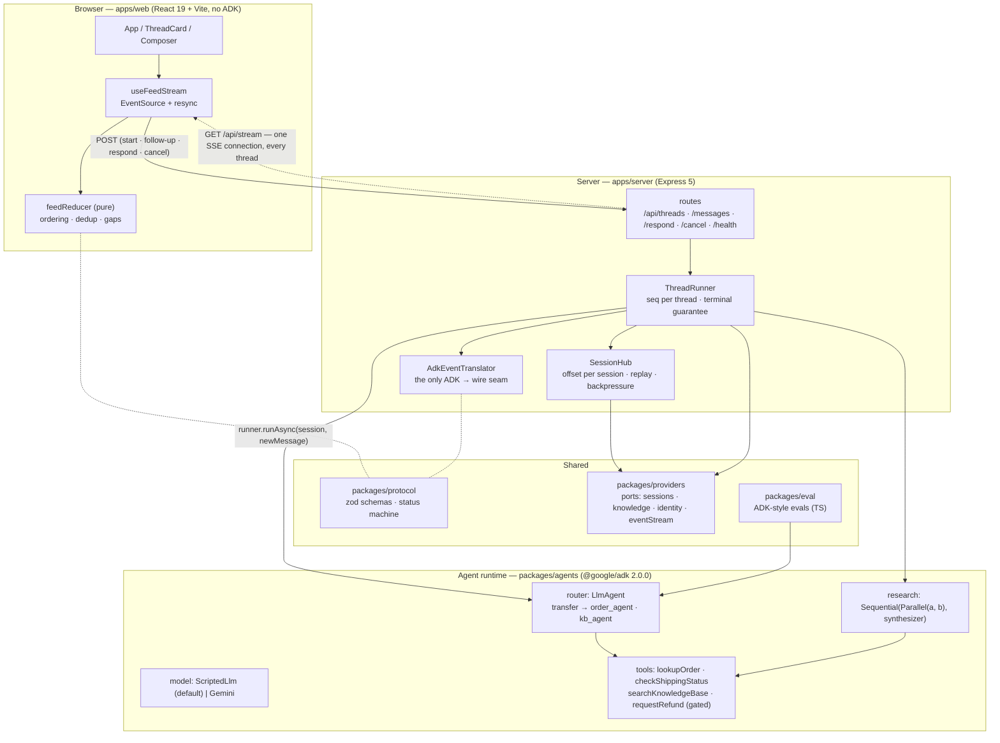

# Architecture

## The shape

A C4-style container view. Solid arrows are calls; the dashed arrow is the one
long-lived SSE connection. The illustrated version, with the same boundaries
drawn and annotated, is [visual/architecture.html](visual/architecture.html).



| | |
|---|---|
| `packages/protocol` | zod schemas + status machine, shared by all of the above |
| `packages/providers` | ports + adapters for everything this app does not implement itself: sessions, knowledge, identity, eventStream ([PROVIDERS.md](PROVIDERS.md)) |
| `packages/eval` | ADK-style agent evaluation (Python-only in ADK itself) |

## The two rules that shape everything

### 1. The client half is framework-free

**Nothing in `@feed/web` or `@feed/protocol` imports `@google/adk`.**

The browser, the reducer, and every Playwright assertion are written against
`FeedEvent`, a plain zod-validated union. Server-side,
`apps/server/src/adk-adapter.ts` is the single place ADK `Event`s become wire
events — so the *translation* has one home, even though the runtime itself is
used wherever agents are built.

Three things fall out:

- The reducer is testable with array literals — no agent framework, no network,
  no timers. That is why the ordering tests are cheap enough to be exhaustive.
- Replacing ADK means rewriting the adapter and the agent package, and touching
  nothing the user can see.
- The UI cannot accidentally depend on an ADK implementation detail, because it
  cannot see one.

### 2. Substrate sits behind a port

Anything this app does not implement itself — conversation storage, retrieval,
identity, the event log — is reached through an interface in `packages/providers`, with an
emulated adapter by default and a real one behind a config flag. `GET
/api/health` reports which is active.

That keeps the emulation honest: it is a named, observable choice rather than
an assumption buried in a constructor. What is emulated, what a real provider
would serve, and where each seam lives is [PROVIDERS.md](PROVIDERS.md).

## Packages

| Package | What it owns | Depends on ADK? |
|---|---|---|
| `packages/protocol` | Wire schemas, `ThreadStatus` machine | no |
| `packages/agents` | Agent graph, tools, `ScriptedLlm`, model resolution | yes |
| `packages/providers` | Substrate ports and their emulated adapters | yes (`BaseSessionService`) |
| `packages/eval` | Evalset format, metrics, runner, CLI | yes |
| `apps/server` | HTTP, SSE hub, thread lifecycle, ADK adapter | yes (adapter only) |
| `apps/web` | React feed, reducer, hooks | no |
| `e2e` | Playwright specs, page objects, fixtures | no |

Workspace packages are consumed as **TypeScript source** (`exports` points at
`src/index.ts`). There is no build step between packages: `tsx` runs the server,
Vite handles the browser, and `tsc --noEmit` typechecks each package. One less
layer between an edit and seeing it work.

## The agent graph

Two entrypoints, chosen because they stress a streaming feed in different ways.

### Multi-turn threads

A thread is a conversation, not a single run. Three endpoints continue one, and
all three reduce to *run again against the same ADK session with a different
message*:

| Endpoint | `newMessage` | Re-enters from |
|---|---|---|
| `POST /api/threads` | the opening prompt | — |
| `POST /api/threads/:id/messages` | the follow-up text | `complete`, `cancelled` |
| `POST /api/threads/:id/respond` | a `functionResponse` quoting ADK's interrupt id | `awaiting_input` |

ADK accumulates history in the session, so the follow-up needs no context
re-sent and the approval resumes a tool call ADK finds in that same history.

### `router` — agent transfer

```
support_router ──transfer_to_agent──► order_agent  (lookupOrder, checkShippingStatus)
                                  └─► kb_agent     (searchKnowledgeBase)
```

One thread whose `author` changes mid-stream. The feed has to re-attribute text
without starting a new thread.

### `research` — parallel fan-out then synthesis

```
research_pipeline (Sequential)
├── parallel_research (Parallel)
│   ├── market_researcher ─► session state `market_finding`
│   └── docs_researcher   ─► session state `docs_finding`
└── synthesizer  (reads both findings from state)
```

Two agents emit **interleaved** partial text on one invocation. This is the case
that breaks naive feeds: without a per-thread `seq` and a per-author
`messageId`, two agents streaming at once produce one scrambled message.

Agent trees are built **fresh per thread**. ADK agents hold a `parentAgent`
back-reference, so sharing one instance across concurrent threads corrupts
transfer routing.

## Four things about ADK worth knowing before you read the code

These were all found by building against `@google/adk` v2.0.0, and each is
pinned by a named regression test.

1. **`transfer_to_agent` takes `agentName`, not `agent_name`.** adk-python uses
   snake_case; adk-js uses camelCase. Getting it wrong makes transfer a silent
   no-op rather than an error.

2. **Transfer rewrites history.** The receiving agent does not get the raw event
   log. ADK converts the previous agent's tool calls and results into synthetic
   **user** messages prefixed `"For context:"`. Anything reading "the latest user
   message" must skip those frames, or every agent downstream of a transfer sees
   `"For context: … Transfer queued"` instead of the actual question.

3. **`StreamingMode.BIDI` throws.** Only `NONE` and `SSE` work in v2.0.0.

4. **`SequentialAgent` and `ParallelAgent` are deprecated** in favour of the new
   `Workflow` graph API — while the same warning notes that `Workflow` cannot
   yet be an `LlmAgent` sub-agent. They are kept here on purpose: they still
   work, and they are what the ADK guides teach. The migration is contained to
   `buildResearch`, and the feed layer would not change at all, because
   `Workflow` emits the same `Event` shape.

## Model modes

| `MODEL_MODE` | Model | Used by |
|---|---|---|
| `scripted` (default) | `ScriptedLlm`, in-process, deterministic | every test, every eval, CI |
| `gemini` | real Gemini via `GOOGLE_API_KEY` | manual exploration |

`LlmAgent.model` accepts `string | BaseLlm`, so the two modes differ in exactly
one expression (`packages/agents/src/model.ts`) and nothing downstream branches.

`ScriptedLlm` mirrors `GoogleLlm`'s streaming shape precisely: N partial
responses carrying only the new chunk, then one final non-partial response
carrying the whole text. That fidelity is what makes it safe to write the
adapter against the fake and trust it against the real one.

## The log and the store: two jobs, two ports

The event stream and a message store look like the same thing stored twice. They
are not, and the difference decides what gets built next.

| | `eventStream` | `messageStore` |
|---|---|---|
| Answers | *what happened next?* | *what is this thread?* |
| Access | sequential, from an offset | random, by `threadId` |
| Lifetime | a retention window — seconds to minutes | permanent |
| Unit | an **event**: a three-word delta, a status change | a **message**: settled final text |
| Volume | ~23 per thread | ~2 per thread |
| Consumer | whoever is tailing, right now | whoever asks, later |

The load-bearing detail is that **`message.delta` does not belong in a store.**
A delta is a transport artefact; "the fourth chunk of the second message" is
worthless the moment `message.complete` lands. Its whole value is latency —
showing text before it is finished. A store writes at settle points only, which
is roughly five writes per thread rather than twenty-three.

So neither replaces the other:

- The **stream** is required by *stream tokens as they are generated*. Without
  it there is no product.
- The **store** is required by *the transcript still exists tomorrow*. Without
  it, history has an expiry date measured in events — which is today
  ([L7](LIMITATIONS.md#l7), [L16](LIMITATIONS.md#l16)).

Having a stream was never the mistake. Using the stream **as** the store was,
and that is now fixed: the store holds settled events keyed by thread, the
stream keeps its retention window, and `GET /api/threads` reads the store.

The one place the distinction had to be enforced in code is the client. A
transcript is not a transport, so hydration bypasses the reducer's ordering
gates — its gaps are the delta `seq` numbers the store deliberately never kept,
and a gate that treated them as loss would buffer a complete transcript forever.

### Where they overlap, and which one wins

Inside the retention window either could serve a reconnecting client. That
overlap is a deliberate cache, and one rule resolves it:

> **The store is truth. The stream is an optimisation.** Where they disagree,
> the store is right.

Which yields the fallback the recovery path already has the shape of:

| Client is | Served by | Cost |
|---|---|---|
| inside the window | stream replay | no query |
| outside the window | store query, then tail | one query |
| brand new | store query, then tail | one query |

Rows two and three are served from the store: `GET /api/threads` returns each
thread's settled transcript, capped per thread by `SNAPSHOT_TRANSCRIPT_LIMIT`
and flagged when the cap bites. Adding the store did not delete the `resync`
flow — it gave it something to return. The reducer's gates are unaffected: a
transport can still deliver duplicates and gaps after a reconnect, so
per-thread `seq` and idempotent application keep earning their place, and the
transcript is folded in idempotently by the same `seq`.

The rule has a second consequence the code now enforces. Because the store is
truth, an event is stored *before* it is published, and its `seq` is committed
only once both have happened — so a store that refuses a write releases the
number rather than leaving a gap the client would buffer against forever
([STREAMING-CONTRACT.md §5c](STREAMING-CONTRACT.md#5c-sequencing-when-the-store-refuses-a-write)).

### Why not drop the log and keep only a store

That is the conventional chat-product architecture — durable store, plus a
socket that carries liveness — and for this feed alone it would be enough.

The log is kept for a reason specific to *agents*: tool calls, transfers, status
transitions and token accounting are interesting to consumers that are not the
UI — evaluation, observability, audit, billing. A store keyed by thread serves
the transcript well and serves those badly. So the stream stays, demoted from
"the only copy" to "liveness, plus the integration point".

The comparison this repo keeps coming back to is Postgres: the WAL is ordered,
sequential and truncated; the tables are keyed, random-access and permanent. It
writes both, and no one calls that redundant.

## Deliberate limits

The complete register — including gaps that are *not* deliberate — is
[LIMITATIONS.md](LIMITATIONS.md). The ones that shape the architecture:

- **In-memory everything.** Sessions, the event log and the transcript each
  have a port, so each durable adapter is a config change rather than a
  refactor — but only the emulated adapters are written. The thread registry
  does not have one: `ThreadRunner` keeps it in a private map, so a durable
  store alone does not bring threads back after a restart
  ([L7](LIMITATIONS.md#l7)). Memory is at least bounded in both directions
  now: per session by `EVENT_RETENTION`, and across sessions by an idle sweep
  ([L3](LIMITATIONS.md#l3)).
- **Single instance.** One process owns a session's log and its subscribers.
  Multi-instance needs the Redis `eventStream` adapter, or sticky sessions
  ([L8](LIMITATIONS.md#l8)).
- **No durable store.** The message store exists and the conflation below is
  resolved, but its only adapter is in memory — so sessions, the event log and
  the transcript all still vanish on restart, and the thread registry would
  too even with a durable adapter behind the others
  ([L7](LIMITATIONS.md#l7)).
- **No auth.** `sessionId` is client-generated and unauthenticated. Real
  deployments need a real identity on the stream.
- **`maxLlmCalls: 20`** per run, as a runaway-loop backstop.
