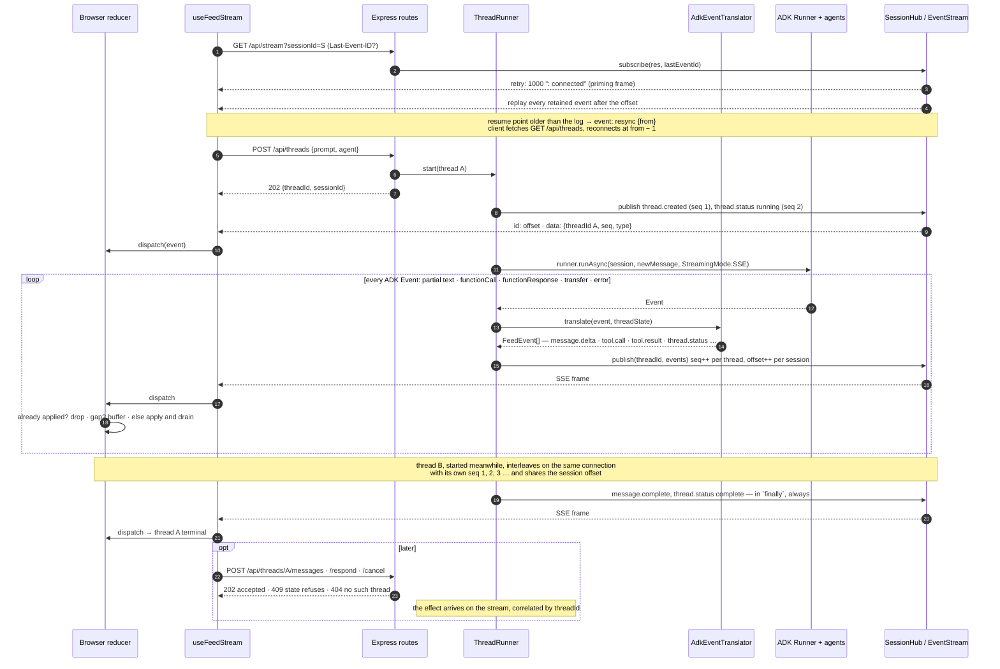
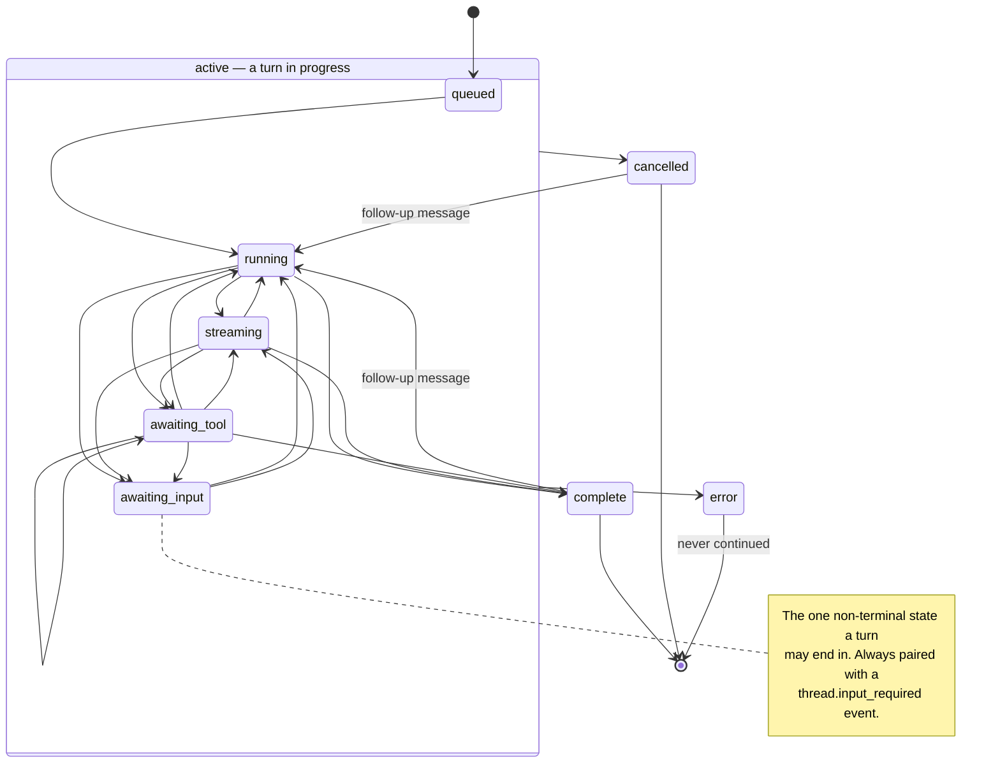

# The streaming contract

Everything the browser knows about what the agents are doing arrives through one
SSE connection. This document is the specification of that connection: what is
guaranteed, what is not, and why the design is shaped this way.

---

## 1. One connection, many threads

A **thread** is one user prompt and the entire agent run it triggers. Several
threads can be in flight at once. All of them share **one** SSE connection per
browser session.

```
browser ──GET /api/stream?sessionId=S──► server
        ◄──── thread A seq 1 ─────────
        ◄──── thread B seq 1 ─────────
        ◄──── thread A seq 2 ─────────
        ◄──── thread B seq 2 ─────────
        ◄──── thread A seq 3 ─────────
```

### One thread, end to end

The same exchange as a sequence. Two things to notice: the `202` carries no
result, because the result arrives on the stream; and `seq` is assigned in one
place, by the runner, after translation.



### Why multiplexed, and what it costs you

| | Multiplexed SSE (chosen) | One SSE per thread | WebSocket |
|---|---|---|---|
| Browser connection cap | 1 connection, unaffected | **breaks at 6 threads** on HTTP/1.1 | 1 connection |
| Reconnect | `Last-Event-ID`, built in | N independent reconnects | hand-rolled |
| Ordering across threads | observable, testable | invisible | observable |
| Client→server mid-stream | separate POST | separate POST | same socket |
| Server complexity | a hub + a replay buffer | almost none | frame protocol, ping/pong, backpressure |

The deciding factor is the first row. Browsers allow **six** concurrent
HTTP/1.1 connections per origin. One stream per thread means the seventh
concurrent thread silently hangs — and it hangs *only under concurrency*, which
is exactly the condition a demo tends not to hit and production does.

### What multiplexing forces you to get right

Three things become your problem the moment threads share a connection. Each is
handled below, and each has tests naming it.

1. **Demultiplexing.** Every event carries `threadId`. There is no implicit
   "current thread".
2. **Per-thread ordering.** A global counter cannot express order once threads
   interleave, so ordering is per-thread (`seq`) and resume is per-connection
   (`offset`). Two counters, on purpose — see §3.
3. **Fairness.** One slow thread must not starve the others. Here, ADK's async
   generators interleave naturally; a production system with heavier per-thread
   work would need an explicit scheduler.

---

## 2. Event shape

Every event carries the same envelope:

```ts
{ threadId: string, seq: number, ts: number, type: ... }
```

| Field | Meaning |
|---|---|
| `threadId` | Which thread. The demultiplexing key. |
| `seq` | Per-thread monotonic counter, **starting at 1**. The ordering guarantee. |
| `ts` | Server wall-clock at emit. **Display only — never ordering.** |

Clocks go backwards, get adjusted, and have coarse resolution. Two events in the
same millisecond are common. `ts` is for rendering a timestamp; `seq` is for
deciding what happened first.

The event types are defined in [`packages/protocol/src/events.ts`](../packages/protocol/src/events.ts):

| Type | Meaning |
|---|---|
| `thread.created` | Always `seq: 1`, always first. Carries the prompt and agent. |
| `message.user` | A follow-up the user sent into an existing thread. Never the opening prompt — that is `thread.created`. |
| `thread.input_required` | The run is paused on a human decision. Carries the interrupt id to quote back, the gated tool, and its arguments. |
| `thread.status` | A lifecycle transition (§4). |
| `message.delta` | Append this text to `messageId`. |
| `message.complete` | The authoritative full text of `messageId`. **Replace, don't append.** |
| `tool.call` | A tool was invoked. Correlates to its result by `callId`. |
| `tool.result` | That tool returned. |
| `thread.error` | Terminal failure. Emitted *before* the terminal status. |

### Why `message.complete` carries the full text

It makes a lost delta self-healing. If delta 3 of 7 goes missing, the message
renders wrong for a few hundred milliseconds and then snaps to correct when the
complete arrives. The alternative — trusting accumulated deltas — turns one
dropped frame into permanently corrupted output.

### Why the error comes before the terminal status

A consumer that stops reading at a terminal status must already have the reason
in hand. Reason first, then state. This ordering is asserted in
`apps/server/src/adk-adapter.test.ts`.

---

## 3. Two counters, and why conflating them is a bug

| | `seq` | `offset` (the SSE `id:` field) |
|---|---|---|
| Scope | per **thread** | per **session** |
| Purpose | ordering semantics | transport resume |
| Consumed by | the client reducer | the browser's `Last-Event-ID` |
| Starts at | 1, for every thread | 1, once per session |

Two threads streaming concurrently *both* emit `seq` 1, 2, 3… That is correct:
ordering is only ever defined **within** a thread, which is the only place it
means anything. "Thread A's token 3 came before thread B's token 2" is not a
fact worth having.

`Last-Event-ID`, meanwhile, is a single value for the whole connection, so it
has to be a single session-wide sequence. One counter cannot do both jobs.

---

## 4. Thread status



Every state inside the box may go to `cancelled` or `error`; `complete` is
reachable from any active state that has done work, which excludes `queued`
and `awaiting_input`.

The table lives in [`packages/protocol/src/status.ts`](../packages/protocol/src/status.ts)
and every one of the 64 status pairs is asserted in `status.test.ts`.

### Server and client treat illegal transitions differently — deliberately

- **Server**: `assertTransition` **throws**. An illegal transition there means
  the adapter mis-classified an ADK event, and you want that loud.
- **Client**: the reducer **ignores** it. A browser must survive a replayed or
  version-skewed stream; crashing the tab is never the better outcome.

This asymmetry earned its keep during development. The thread runner used to
publish the initial `running` status directly instead of through the translator,
which left the two state machines on different states. `assertTransition` threw
and failed the thread immediately — a five-minute fix instead of a subtle
mis-render nobody would have noticed for weeks.

### Guarantee: every turn reaches a terminal status, or a pause the client can answer

Enforced by a `finally` block in `apps/server/src/thread-runner.ts`, so it holds
when the model errors, when the client cancels, and when ADK throws. Any message
still open is closed out at the same time, so no caret is left blinking on a
thread that has stopped.

**"Turn", not "thread", and the distinction is load-bearing.** A thread is a
conversation and may take a follow-up, so `complete` and `cancelled` each have
exactly one outgoing edge — back to `running`. `error` has none: a failed run
left an unknown amount of work half applied.

The second half of the guarantee is the human-in-the-loop pause. A run gated on
`requireConfirmation` ends its generator without finishing, and closing it out
as `complete` would be both false and unanswerable. So `awaiting_input` is the
one non-terminal state a turn may end in — and it is only reachable alongside a
`thread.input_required` event naming what would unblock it. A pause nobody can
answer is a hang.

### Multi-turn: three ways in, one path through

`POST /api/threads` (open), `POST /api/threads/:id/messages` (follow up) and
`POST /api/threads/:id/respond` (approve or deny) all do the same thing: run
again against the thread's existing ADK session, with a different
`newMessage`. History accumulates in that session, which is why a follow-up can
be answered from an earlier turn and why an approval can resume a paused tool
call — ADK finds the confirmation in the same history.

All three return `202` and nothing else useful; the consequences arrive on the
stream, correlated by `threadId`. `409` distinguishes *the state refuses this*
from `404` *no such thread*, which is what a client needs to decide whether
retrying could ever help.

`respond` additionally requires the `requestId` to match what is actually
pending, rather than answering whatever is waiting. A stale click authorising an
action nobody read is the failure that guard exists for, and ADK makes the same
check on its side and fails closed.

---

## 5. Reconnect

The browser reconnects on its own and sends `Last-Event-ID`. The server replays
everything after that offset from the session's event log — bounded, and by
default holding the last `EVENT_RETENTION` (500) events. The log lives behind
the `eventStream` port ([PROVIDERS.md](PROVIDERS.md)), not inside `SessionHub`;
the hub reads it and writes SSE frames.

- **Overlap is expected.** The reducer drops any `seq` it has already applied.
- **Gaps are buffered.** An event arriving ahead of its predecessors is held
  until the gap closes, then the whole run is applied in order.
- **Buffer overrun triggers a rebuild.** The server sends a `resync` frame in
  either of two cases: a client *resuming* from an offset older than anything
  still buffered, or a client connecting *fresh* to a session whose beginning
  has already rolled out — a page reload after a long or busy session. The
  second is easy to overlook, because that client has no stale offset to be
  wrong about; it just starts in the middle. The client tears
  the stream down, fetches `GET /api/threads` for a snapshot of the session's
  threads — each carrying its current `lastSeq` — dispatches a `resync` action,
  and reconnects at the offset the notice named, so the server replays
  everything it still holds. Rebuilt threads do *not* adopt the snapshot's
  `lastSeq` as a watermark — that would discard the very replay about to
  arrive. They accept the next event wherever it lands and learn from its `seq`
  whether a prefix was genuinely lost.

  Identity and status are recovered; the transcript of rolled-out events is not,
  because events live only in the buffer. A restored thread is marked
  `historyTruncated` and says so in the UI rather than passing itself off as
  complete.

### Two things that are easy to get wrong

**An SSE endpoint must write a body byte immediately.** `res.flushHeaders()`
flushes *your* response, but any intermediary — a dev proxy, nginx, a load
balancer — has its own outbound response, and Node does not put those headers on
the wire until something writes a body chunk. On an idle feed the first chunk
could be a heartbeat 15 seconds later, and the browser's `EventSource` sits in
`CONNECTING` the whole time without firing `onopen`. The fix is one priming
frame:

```
retry: 1000
: connected
```

which also sets the browser's reconnect backoff. This cost real debugging time
here; it is now pinned by a test named after the symptom.

**`EventSource` auto-retry is not portable.** Chromium retries a dropped stream
indefinitely. Firefox gives up on some failures and parks the connection in
`CLOSED`, where nothing will ever reopen it. So the client watches for
`readyState === CLOSED` and re-creates the `EventSource` itself. A hand-made
connection does not carry the browser's `Last-Event-ID`, which is why the server
also accepts `?lastEventId=` — the manual resume path.

Both behaviours are covered by the Playwright suite, which runs on Chromium
**and** Firefox for exactly this reason.

---

## 5a. The snapshot endpoint

```
GET /api/threads?sessionId=S  →  { threads: ThreadSummary[] }
```

`ThreadSummary` is `{ id, prompt, agent, status, createdAt, lastSeq }` — a
thread's identity and position, never its content. It exists for exactly one
caller, the recovery path above, and is cheap and idempotent so a client may
call it whenever it suspects it has drifted.

`lastSeq` is a hint, not a watermark. A rebuilt thread uses it only to decide
whether to warn that history may be missing; it does not seek forward to it,
because the replay that follows usually contains the very events it would have
skipped. What a thread actually missed is read from the `seq` of the first event
that arrives after the rebuild.

## 5b. Is this the real pattern, or a stand-in?

Worth being precise about, because the two halves of the answer differ.

### The mechanism is real

Live stream with a bounded window, plus a catch-up endpoint for clients that
fall out of it, is how production systems actually do this:

| System | The window | Falling out of it |
|---|---|---|
| Kafka | retention on the partition | offset out of range → `auto.offset.reset` |
| Postgres logical replication | WAL retention | slot invalidated → re-snapshot the table |
| Slack / Discord gateways | reconnect with a session id | gateway resume fails → REST backfill of messages |

The Slack/Discord shape is the closest: a socket you resume, and a REST endpoint
you fall back to. `Last-Event-ID` + `GET /api/threads` is the same two-part
design, and nothing about it is simulated — `Last-Event-ID` is a web platform
feature, and the buffer genuinely rolls.

### The topology is a boilerplate simplification

Here is the part that is *not* production-shaped, and it is one decision:

> **The event log is also the message store.** There is nowhere else agent
> messages exist. The `eventStream` provider holds the last `EVENT_RETENTION`
> events per session, and that is the entire history of the conversation.

In a real system those are two different things, because they answer different
questions. A log answers *what happened next* over a window; a transcript is
*state read by key and kept indefinitely*. Events would be written to a durable
store at their settle points, and the log would be nothing but a low-latency
tail in front of it. A client that fell out of the window would page history
from the store and see a complete conversation.

Note what that does **not** mean: persisting the log is not the fix. A Redis
adapter makes this same window durable and multi-instance, and a transcript
still expires. The division of labour is set out in
[ARCHITECTURE.md](ARCHITECTURE.md#the-log-and-the-store-two-jobs-one-of-them-unfilled).

Everything that feels wrong about recovery here follows from that one
conflation:

- The snapshot returns a thread's **identity** (`prompt`, `agent`, `status`,
  `lastSeq`) and no messages, because there are no messages to return.
- `historyTruncated` and *"Messages for this thread are no longer available"*
  exist at all. A chat product would never say that; it would fetch the
  messages.
- A long session degrades into unreadable history ([L16](LIMITATIONS.md#l16)),
  because the readable window is fixed while the thread list grows.

So: the protocol is a faithful implementation of a real pattern, and the
recovery path is wired end to end. What is missing is the store behind the
snapshot — [L7](LIMITATIONS.md#l7). Add it and nothing here is torn out: the
`resync` frame, the snapshot endpoint and the reducer's gates all keep their
shape, because a transport can still deliver duplicates and gaps after a
reconnect however durable the history is. The snapshot simply starts returning
messages instead of metadata, and truncation stops being user-visible.

## 6. Cancellation

`POST /api/threads/:id/cancel` aborts an `AbortController` whose signal is
passed into `runner.runAsync`. ADK stops the run; the `finally` block emits
`cancelled` and closes any open message.

Returns `202` if the abort was delivered, `409` if the thread had already
finished, `404` if it never existed.

---

## 7. What is deliberately not here

The full register, including the gaps that are *not* deliberate, is
[LIMITATIONS.md](LIMITATIONS.md). What follows is the subset that shapes this
protocol.


- **No client→server mid-stream channel.** Commands are ordinary POSTs, not
  frames on the SSE connection — SSE is one-directional, so the client has no
  way to write onto the socket it's reading from. `POST /api/threads/:id/cancel`
  is the existing example: the request itself only carries accept/reject
  (`202`/`409`/`404`); the actual effect (the thread reaching `cancelled`) is
  observed asynchronously back on the stream via `thread.status`, correlated by
  `threadId`. This keeps the hub single-writer, which is what makes the
  ordering guarantees in §1–3 tractable — if the client could also inject
  frames, `seq` would need to account for two origins instead of one. If
  human-in-the-loop tool approval were built out, `awaiting_input` is the state
  it would use and a POST is what would resolve it.
- **No persistence, and no message store at all.** Sessions and the event log
  are in memory, and there is no separate store of messages behind either —
  §5b and [L7](LIMITATIONS.md#l7). ADK ships `DatabaseSessionService` for the
  first half; the second half is a port that does not exist yet.
- **No shared event stream.** The stream provider is in-process, so each
  instance holds its own log and its own subscribers. A multi-instance
  deployment needs the Redis adapter (or sticky sessions). The seam exists —
  `PROVIDER_EVENTSTREAM` — but only the memory adapter is written.

  ("Fan-out" in this repo means a `ParallelAgent` running its children
  concurrently, not this.)
- **No bidirectional streaming.** ADK's `StreamingMode.BIDI` throws in v2.0.0.
  SSE is not a preference here; it is the supported mode.
