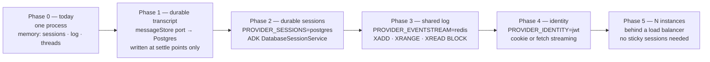

# System design

The design at the level above the code: what it is for, what it must not do,
the alternatives that were considered and why they lost, how it fails, and how
it would grow. The mechanism-level detail lives in
[ARCHITECTURE.md](ARCHITECTURE.md) and
[STREAMING-CONTRACT.md](STREAMING-CONTRACT.md); this page does not repeat it.

## Goals

1. **Several agent threads stream at once, in order, on one connection.** The
   user sends a prompt, then another before the first finishes, and both
   render correctly. This is the product.
2. **A thread is a conversation.** Follow-ups continue it; a paused tool call
   can be approved or denied by a person.
3. **The client survives the network.** Reconnect replays what was missed;
   falling out of the replay window is detected and recovered, never silent.
4. **Everything is testable offline.** No API key on any critical path, and
   the streaming behaviour itself — not just the code around it — is under
   test.
5. **Infrastructure is a choice, not an assumption.** Anything the app does
   not implement itself sits behind a port with an emulated default, so the
   emulated-versus-real line is explicit and observable.

## Non-goals

- Production hardening: authentication, persistence, horizontal scale. Each is
  a named limitation with a seam ready for it, not a feature of this repo.
- A general chat product. There is no user model, no thread list across
  sessions, no search.
- Bidirectional streaming. ADK 2.0.0's `BIDI` mode throws; SSE is the supported
  mode, and one-directional is what the design wants anyway (see
  [ADR-0001](adr/0001-one-multiplexed-sse-connection.md)).

## Constraints

| Constraint | Consequence |
|---|---|
| Browsers cap HTTP/1.1 at **six** connections per origin | One stream per thread hangs the seventh; multiplexing is forced |
| `EventSource` cannot set headers, and its retry differs by engine | Session id travels as a query parameter; the client re-creates the connection itself when the browser gives up |
| ADK is the agent runtime and its `Event` shape is the input | Translation to the wire contract happens in exactly one place |
| Timing tests against a live LLM are flaky by construction | A deterministic `BaseLlm` that mirrors Gemini's streaming shape |
| Node's `res.write` queues without a ceiling | Explicit per-subscriber backpressure |
| One process, in-memory state | Retention windows and idle sweeps bound memory; nothing survives a restart |

## Alternatives rejected

| Alternative | Why not | Where the reasoning lives |
|---|---|---|
| One SSE connection per thread | Breaks at six concurrent threads, and only under concurrency, which is exactly what demos miss and production hits | [ADR-0001](adr/0001-one-multiplexed-sse-connection.md) |
| WebSocket | Solves the connection cap but hand-rolls reconnect, framing, ping/pong and backpressure that SSE gets from the platform; the client→server channel it offers is not needed because commands are ordinary POSTs | STREAMING-CONTRACT §1 |
| Polling `GET /api/threads` | Latency floor of the poll interval; no token-level streaming; N× the request volume | — |
| One global sequence number | Cannot express per-thread order once threads interleave; `Last-Event-ID` needs a per-connection counter regardless | [ADR-0002](adr/0002-two-counters-seq-and-offset.md) |
| Trusting accumulated deltas as the message | One dropped frame corrupts the message permanently; `message.complete` carrying full text makes loss self-healing | STREAMING-CONTRACT §2 |
| Recorded LLM fixtures (VCR-style) | Brittle across prompt edits; still cannot produce interleaving on demand; a scripted `BaseLlm` gives control over timing and branching | [ADR-0003](adr/0003-deterministic-scripted-model.md) |
| Letting the UI consume ADK events directly | Couples the client to a framework version; makes the reducer untestable without ADK | [ADR-0004](adr/0004-adk-confined-to-the-server.md) |
| Persisting the event log as the fix for lost history | Makes the wrong-shaped store durable; a transcript still expires with the window | [ADR-0006](adr/0006-event-log-is-not-the-message-store.md) |
| Treating the snapshot's `lastSeq` as a watermark on resync | Discarded the replay that followed; the thread rendered empty while its transcript was thrown away | [L1](LIMITATIONS.md#l1) |
| Migrating to ADK's `Workflow` API now | Cannot yet be an `LlmAgent` sub-agent; the deprecated agents still work and are what the guides teach | [L15](LIMITATIONS.md#l15) |

## Failure modes

How each failure surfaces, what bounds it, and what a person sees.

| Failure | Detection | Containment | User-visible result |
|---|---|---|---|
| Model returns an error | ADK event with `errorCode` | `thread.error` then `thread.status: error`; open message closed in `finally` | Thread shows the error and `Failed`; no follow-up offered |
| ADK throws mid-run | `catch` in the runner | Same `finally` path | Same |
| Client cancels | `AbortController` | ADK stops; `cancelled` emitted; other threads untouched | `Stopped`, message cut mid-sentence, follow-up offered |
| Network drop | `EventSource` error / `CLOSED` | Browser retry (`retry: 1000`) or manual re-create; `Last-Event-ID` replay | `Reconnecting…` then the missed events land in order |
| Reconnect after the window rolled | `oldestOffset > resume point` | `resync` frame → snapshot → reconnect at `from − 1`; loop prevented by test | Threads restored; lost transcripts say so |
| Duplicate or out-of-order frames | Reducer gates on `seq` | Drop / buffer / drain; counters distinguish redundant from lossy | Nothing |
| Stalled consumer | `writableLength > SSE_MAX_BUFFERED_BYTES` | Subscriber disconnected; reconnect handshake recovers | A reconnect, invisible if within the window |
| Sessions accumulate | Idle sweep | Hub and log dropped after `SESSION_IDLE_TTL_MS` with no subscribers; a running thread counts as activity | A returning session past the TTL starts fresh |
| Agent loops on tools | `maxLlmCalls: 20` | ADK aborts the run; terminal status still emitted | `Failed` |
| Stale approval click | `requestId` mismatch | `409`; ADK also fails closed | An error toast; nothing executed |
| Illegal status transition (adapter bug) | `assertTransition` throws on the server | Thread fails loudly in tests | — (caught before shipping) |
| Process restart | — | **Uncontained** ([L7](LIMITATIONS.md#l7)): sessions, threads and log are gone | Empty feed; reconnect finds nothing |
| Reconnect routed to another instance | — | **Uncontained** ([L8](LIMITATIONS.md#l8)): silent, no replay | Missing events with no notice |

## Scaling path

Each step is a config change against an existing port, in the order that
removes the most risk first. Capacity figures use the measured scripted cost
of `5 + 4T + ⌈W/3⌉` events per turn (10–40) and an SSE frame of roughly
150–300 bytes.



### Phase 0 — single instance (today)

- One Node process. State per session: up to `EVENT_RETENTION` (500) events
  ≈ 100–150 KB, plus up to 1 MiB of queued writes per stalled subscriber.
- Rough envelope: a 512 MB container holds on the order of a thousand idle
  sessions or a few hundred busy ones; the binding limit is the per-subscriber
  write ceiling under stall, not the log.
- Fails on restart and on any second instance.

### Phase 1 — a message store (closes L7 and L16)

The one missing *capability* rather than a missing adapter. A `messageStore`
port written at settle points — `message.complete`, `tool.call`,
`tool.result`, status transitions — never `message.delta`. Roughly five writes
per thread instead of twenty-three. Postgres, one table keyed by
`(sessionId, threadId, seq)`.

The store becomes truth and the stream is demoted to liveness. `GET
/api/threads` starts returning messages; `historyTruncated` stops being
user-visible; the `resync` flow keeps its exact shape. See
[ADR-0006](adr/0006-event-log-is-not-the-message-store.md).

### Phase 2 — durable agent sessions

`PROVIDER_SESSIONS=postgres` via ADK's `DatabaseSessionService`, sharing the
Phase 1 database. This is what makes follow-ups and paused approvals survive a
restart: both are answered from ADK's session history.

### Phase 3 — a shared event stream (closes L8)

`PROVIDER_EVENTSTREAM=redis`: Redis Streams gives storage (`XADD` with
`MAXLEN`), replay (`XRANGE`) and delivery (`XREAD BLOCK`) from one primitive,
which is why storage and delivery are one port. The contract suite in
`packages/providers` already pins what `SessionHub` needs: dense offsets from
1, observable `oldestOffset`, nothing lost across `open`/`flush`.

The one real obstacle: Redis stream ids are `ms-seq` strings, not integers,
and `from − 1` arithmetic is load-bearing in the resync handshake. The adapter
has to map a per-session integer offset onto stream ids (a `HINCRBY` counter
per session, stored in each entry, is enough). Detailed in
[visual/event-stream.html](visual/event-stream.html).

Sticky sessions at the load balancer are the alternative that avoids the
problem instead of solving it; acceptable as a stopgap, not as the design.

### Phase 4 — identity (closes L9)

`PROVIDER_IDENTITY=jwt`. The routes already resolve the caller through the
port. The client change is the harder half: `EventSource` cannot send an
`Authorization` header, so either a same-site cookie carries the token or the
client moves to `fetch` with a streaming body reader.

### Phase 5 — horizontal

With Phases 1–4 done any instance can serve any session: the log is shared,
the transcript is durable, identity is verified. Remaining work is
operational — health-based routing, and the observability wiring
([L14](LIMITATIONS.md#l14), OpenTelemetry) so `droppedLossy > 0` pages
someone.

### What does not change at any phase

The wire contract, the reducer's gates, the status machine, and the adapter.
A transport can still deliver duplicates and gaps after a reconnect however
durable the history is, so per-thread `seq` and idempotent application keep
earning their place.

## Cost envelope

**Today: zero.** `MODEL_MODE=scripted` is the default for development, tests,
evals and CI. No external service is called anywhere on the critical path.

**With a real model.** Cost per thread is

```
calls × (input tokens × input rate + output tokens × output rate)
```

where `calls ≤ maxLlmCalls (20)` and, for the shipped agents, is typically 2–4
(router transfer, one or two tool rounds, the answer). Input tokens grow with
session history on every follow-up, because ADK re-sends the accumulated
conversation — the dominant term for long threads. The research pipeline
makes three model calls minimum (two researchers, one synthesiser).

Illustrative, at a small-model price point in the low cents per million
tokens: a support thread of ~3 calls and ~3 k tokens costs a fraction of a
cent; a thousand threads a day sits in the low single dollars per day. Check
current pricing before relying on the figure; the shape of the formula is
what this section is asserting.

**What bounds it.**
- `maxLlmCalls: 20` caps calls per run.
- The approval gate stops the one tool with a real-world cost from running
  unattended.
- There is no per-caller quota ([NFR-S7](REQUIREMENTS.md#security)); a public
  deployment needs one before the model bill is bounded per user.

**Infrastructure at Phase 5.** One small Postgres, one small Redis, N small
containers. The event stream is bounded by `MAXLEN`; the store grows at ~5
rows per thread and is the only thing that grows without bound by design.
